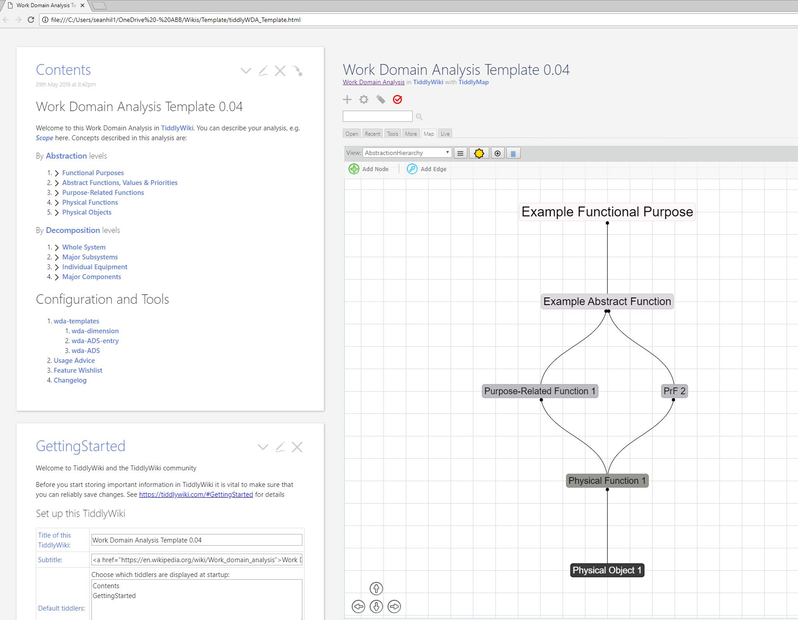

# tiddlyWDA
A TiddlyWiki template for Work Domain Analysis

Based on TiddlyMap, available at
https://github.com/felixhayashi/TW5-TiddlyMap

Work Domain Analysis is a classic cognitive engineering 'concept map' method, described well by Naikar, Hopcroft, and Moylan here: 
https://apps.dtic.mil/dtic/tr/fulltext/u2/a449707.pdf

Improvements very welcome!  Also advice on how to collaborate effectively on GitHub.

